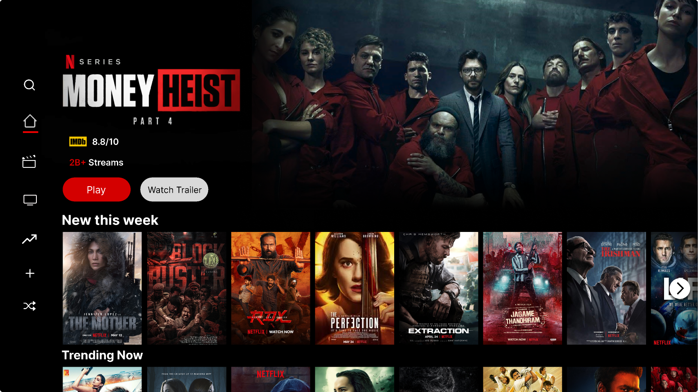
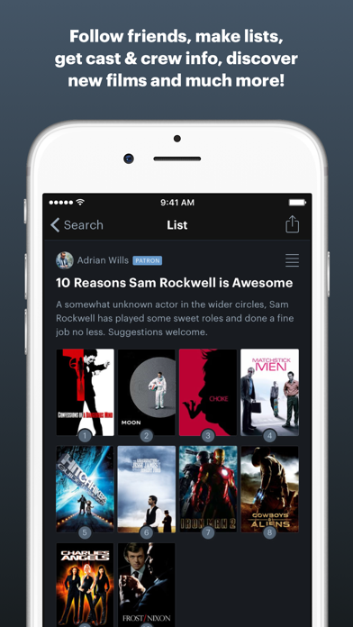

# Próxima Sessão — Referências visuais

Referências da ETAPA 4, consultadas em 15/09/2026 e complementadas na revisão documental com o [template oficial](../../template_ref/references.md). Relacionadas ao escopo de [requirements.md](../requirements.md) e à organização de [architecture.md](../architecture.md).

## 1. Objetivo

As três referências reais abaixo orientam a experiência e a interface do Próxima Sessão. Cada uma registra fonte, imagem, observação, aplicação e adaptação, sem ampliar as funcionalidades aprovadas. As imagens utilizadas ficam em `docs/references/imagens/`, conforme o template do professor.

## 2. Referência 01 — Netflix: destaque para o catálogo

### Fonte

- [Página oficial da Netflix Brasil](https://www.netflix.com/br/), usada na referência inicial de organização do catálogo.
- [Apresentação oficial da experiência de TV](https://about.netflix.com/pt_br/news/unveiling-our-innovative-new-tv-experience), publicada em 07/05/2025, fonte da imagem acrescentada nesta revisão.
- [Animação original publicada pela Netflix](https://downloads.ctfassets.net/4cd45et68cgf/61IUzZnwqhPnnjpf5OhOmf/400fcfd2c00744f7375bac0b584cd8b4/Wednesday-slide16.gif?w=2000).

### Imagem

Registro: captura de um quadro da animação oficial, exibida no navegador. A captura direta da página comercial havia sido bloqueada pela rede; esta imagem vem do material público da Netflix e mostra a interface de TV, não uma captura da página brasileira.

### O que observamos?

A apresentação dá prioridade ao catálogo e separa conteúdos em grupos com títulos claros. A referência inicial da seção “Em alta” e a imagem complementar de TV mostram o destaque visual dado às produções e à navegação.

### O que foi aproveitado?

Na Home, as seções “Filmes em alta” e “Séries em alta” reúnem pôsteres e identificação do conteúdo. Essa organização ajuda o usuário a reconhecer opções rapidamente e começar a explorar sem digitar uma busca.

### Como foi adaptado?

O MVP usa uma grade simples com CSS, cards de tamanho consistente e identidade própria em grafite e verde-lima. Não reproduz o carrossel, o ranking, a personalização ou a reprodução de vídeo da referência.

## 3. Referência 02 — Letterboxd: pôsteres e organização de títulos

### Fonte

- [Página oficial](https://letterboxd.com/) e [apresentação oficial dos aplicativos](https://letterboxd.com/apps/).
- [Página oficial do aplicativo na App Store](https://apps.apple.com/us/app/letterboxd/id1054271011), indicada pelo próprio site do Letterboxd e publicada pelo desenvolvedor Letterboxd.
- [Imagem original da lista com pôsteres](https://is1-ssl.mzstatic.com/image/thumb/Purple211/v4/07/d8/fb/07d8fba4-5e27-80d4-89ab-e23bd65d8df8/pr_source.png/392x696bb.png).

### Imagem

Registro: imagem de divulgação fornecida pelo desenvolvedor na App Store. Substitui, nesta documentação, o arquivo anteriormente associado a “Explore film”, que não mostrava a interface descrita. A imagem atual foi inspecionada visualmente e mantida sem alterações.

### O que observamos?

Os pôsteres são organizados em uma grade compacta sobre fundo escuro, com proporções consistentes e espaços regulares. O agrupamento deixa a coleção de títulos visível em uma única área.

### O que foi aproveitado?

Cards reutilizáveis na Home, Busca e Minha Lista, mantendo a mesma organização visual ao descobrir e guardar conteúdos. Os pôsteres ajudam a reconhecer os títulos, enquanto os espaços regulares facilitam a leitura.

### Como foi adaptado?

Os cards do MVP incluem título, tipo, ano e nota da TMDB quando disponíveis, e a grade se adapta ao tamanho da tela. A lista é única e local ao navegador. Avaliações pessoais, diário, ranking, perfis e recursos sociais da referência não fazem parte do projeto.

## 4. Referência 03 — Notion: hierarquia e espaço entre elementos

### Fonte

[Página oficial do produto Notion](https://www.notion.com/product).

### Imagem

Registro: captura da página pública no navegador, em 15/09/2026. O arquivo original foi preservado e copiado sem alterações para a pasta indicada pelo template.

### O que observamos?

Título principal grande, texto de apoio curto, espaços generosos e distinção visual entre ação principal e secundária.

### O que foi aproveitado?

A apresentação da Home, os cabeçalhos de Busca e Minha Lista e os estados vazios usam uma orientação curta e uma ação clara. Isso deixa evidente o propósito de cada página e reduz o esforço para entender o próximo passo.

### Como foi adaptado?

Esses princípios foram aplicados com fundo escuro, fonte de sistema e uma única cor de destaque. O layout, as ilustrações e as funcionalidades do Notion não foram reproduzidos.

## 5. Síntese para a interface

| Decisão | Aplicação |
| --- | --- |
| Fundo grafite e texto claro | Todas as páginas. |
| Verde-lima como destaque | Marca, ação principal, links ativos e foco. |
| Pôsteres em grade | Home, resultados e lista. |
| Títulos grandes e texto de apoio curto | Apresentação e cabeçalhos. |
| Ícones acompanhados de texto | Navegação e ações. |
| Estados vazios com orientação | Busca inicial, resultados vazios e lista vazia. |

As imagens nesta pasta pertencem aos respectivos produtos e são referências acadêmicas. Não são incorporadas à interface. As imagens do catálogo são fornecidas pela TMDB. A revisão manteve as quatro páginas e funcionalidades previstas em F01/RF01 a F06/RF06.

## 6. Conferência dos arquivos

| Referência | Caminho relativo a este documento | Verificação |
| --- | --- | --- |
| Netflix | `./imagens/netflix-home.png` | Arquivo PNG local conferido visualmente. |
| Letterboxd | `./imagens/letterboxd-explorar.png` | Arquivo PNG local conferido visualmente. |
| Notion | `./imagens/notion.png` | Captura PNG original preservada e conferida visualmente. |

Os três caminhos usados nas imagens Markdown apontam para arquivos existentes em `docs/references/imagens/`. Os arquivos anteriores em `imagens-de-referencia/` foram preservados como histórico e não são usados pelos links deste documento.
